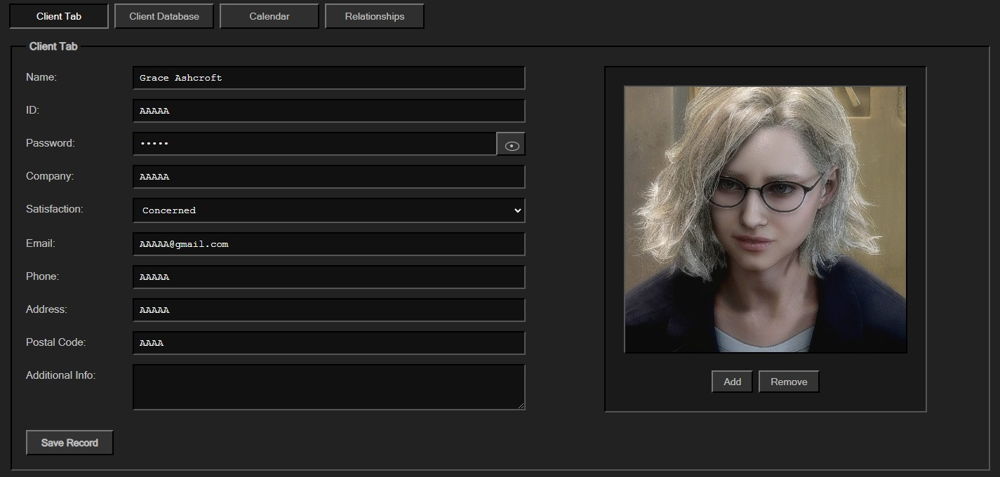
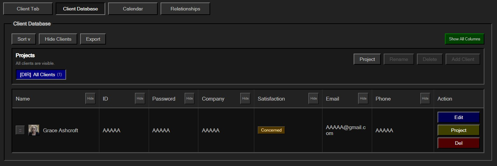
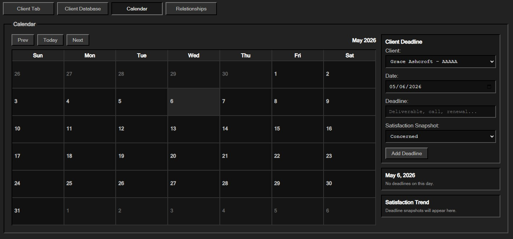
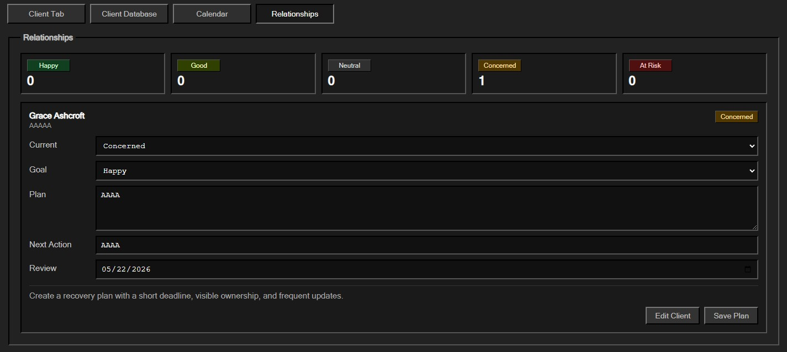

# RetroCRM
A free, easy to use retro CRM app focused on storing client information and managing internal relationships

# Installation
[Download for Windows](https://github.com/Odenjvn/RetroCRM/releases/download/Installer/RetroCRMSetup1.0.0.exe)

Simply download and run the installer!

# Functionality
- Add, edit, update, and delete client records. You have the ability to add and remove client profile images, view all saved clients in a database-style table, hide/show individual table columns and full client lists, select and drag clients using a handle to reorder them (similar to song playlists), select and copu client text without accidentally dragging rows and sort client list alphabetically or by custom criteria.
- Create project folders inside the app. This helps separate clients by specific labels.
- Export all the information stored. Upon exporting, a folder will be created in the main directory with the .txt inside it.
- Manually assign each client a satisfaction level (Available levels: Happy, Good, Neutral, Concerned, and At Risk). It's possible to see all clients grouped by satisfaction level, manage relationship plans for each client, set a satisfaction goal, add a relationship improvement or maintenance plan and add next actions and review dates.
- Add client deadlines to a calendar. This way you can attach each deadline to a specific client and save a satisfaction snapshot for each deadline. View deadlines by selected day and compare satisfaction trends across recent days.
